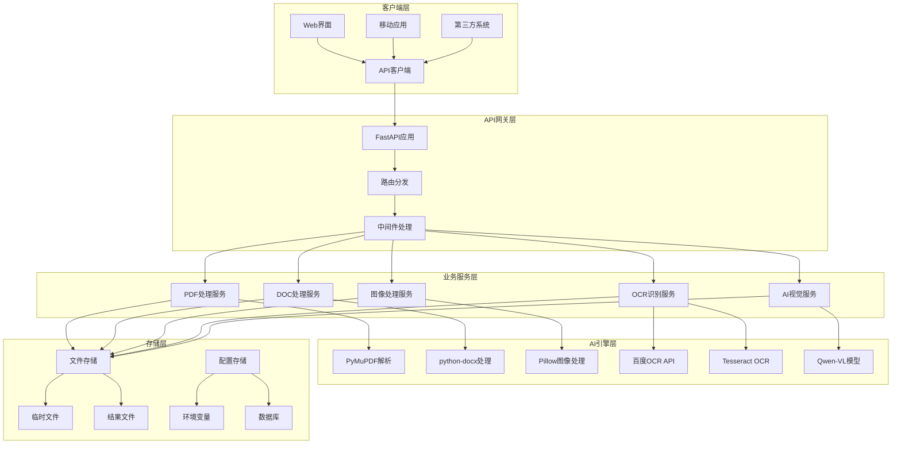

# ConvertToText - 智能文档文字提取系统

<div align="center">


**一个基于AI的智能文档文字提取系统，支持PDF、DOC、DOCX等多种格式，集成OCR识别和多模态大语言模型，提供高精度的文字提取服务。**

[快速开始](#快速开始) • [功能特性](#功能特性) • [API文档](#api文档) • [部署指南](#部署指南)

</div>

## 📋 项目概述

ConvertToText 是一个企业级的智能文档处理系统，专门解决复杂文档的文字提取难题。无论是扫描版PDF、图文混合文档，还是复杂排版的合同报表，都能精准提取所有可见文字内容，保持阅读顺序与语义结构。

### 🎯 核心价值

- **智能识别**: 自动检测文档类型，选择最优处理策略
- **高精度提取**: 集成OCR引擎和多模态AI模型，确保提取质量
- **多格式支持**: 支持PDF、DOC、DOCX、图片等多种格式
- **企业级架构**: 基于FastAPI构建，支持高并发和微服务部署
- **开源免费**: MIT许可证，可自由使用和修改

### 🚀 适用场景

- **企业文档数字化**: 将纸质文档转换为可编辑的电子文档
- **合同管理系统**: 自动提取合同关键信息，支持智能分析
- **财务报表处理**: 批量处理银行对账单、发票等财务文档
- **学术论文解析**: 提取论文内容，支持知识库构建
- **法律文档分析**: 处理法律条文、判决书等专业文档

## ✨ 功能特性

### 🔍 智能文档分析

- **四步法处理流程**: 内容检测 → 原生提取 → 图像处理 → 智能融合
- **自动类型识别**: 智能判断文档类型，选择最优处理策略
- **版面结构分析**: 保持文档的原始结构和格式信息

### 🤖 AI驱动处理

- **双轨并行处理**: OCR引擎 + 多模态大语言模型同时工作
- **智能融合决策**: 基于置信度、长度、质量等多维度评分进行结果融合
- **语义理解增强**: 利用Qwen-VL等模型理解文档语义，提升提取质量

### 📄 多格式支持

- **PDF处理**: 支持原生文本、扫描文档、图文混合等多种类型
- **Office文档**: 完整支持DOC、DOCX格式的文档处理
- **图像识别**: 支持JPG、PNG、BMP、TIFF等主流图像格式
- **批量处理**: 支持单文件和批量文件处理

### 🛠️ 企业级特性

- **RESTful API**: 标准化的API接口，易于集成
- **异步处理**: 支持大文件异步处理，不阻塞请求
- **文件管理**: 自动文件清理、存储管理
- **监控日志**: 完整的处理日志和性能监控
- **容器化部署**: 支持Docker部署，便于运维

## 🏗️ 系统架构



## 🚀 快速开始

### 环境要求

- Python 3.8+
- Conda (推荐) 或 pip
- 内存: 最小2GB，推荐4GB+
- 存储: 根据文档数量确定

### 1. 克隆项目

```bash
git clone https://github.com/your-username/ConvertToText.git
cd ConvertToText
```

### 2. 环境配置

#### 使用Conda (推荐)

```bash
# 创建conda环境
conda create -n convert-to-text python=3.8
conda activate convert-to-text

# 安装依赖
pip install -r requirements.txt
```

#### 使用pip

```bash
# 创建虚拟环境
python -m venv venv
source venv/bin/activate  # Linux/Mac
# 或 venv\Scripts\activate  # Windows

# 安装依赖
pip install -r requirements.txt
```

### 3. 环境变量配置

创建 `.env` 文件：

```bash
# 应用配置
APP_NAME=ConvertToText
APP_VERSION=1.0.0
DEBUG=true
HOST=0.0.0.0
PORT=8000

# 百炼平台配置 (必需)
DASHSCOPE_API_KEY=your_dashscope_api_key
DASHSCOPE_MODEL=qwen-plus

# 百度OCR配置 (必需)
BAIDU_OCR_API_KEY=your_baidu_ocr_api_key
BAIDU_OCR_SECRET_KEY=your_baidu_ocr_secret_key

# OpenAI配置 (可选)
OPENAI_API_KEY=your_openai_api_key
OPENAI_MODEL=gpt-3.5-turbo
```

### 4. 启动服务

#### 使用启动脚本 (推荐)

```bash
# 使用提供的启动脚本
chmod +x start.sh
./start.sh
```

#### 手动启动

```bash
# 激活环境
conda activate convert-to-text

# 启动服务
python main.py
```

### 5. 验证安装

访问以下地址验证服务是否正常：

- **服务主页**: http://localhost:8000
- **API文档**: http://localhost:8000/docs
- **健康检查**: http://localhost:8000/api/v1/health

## 📚 API文档

### 核心接口

| 功能模块           | 接口路径                           | 方法 | 描述             |
| ------------------ | ---------------------------------- | ---- | ---------------- |
| **健康检查** | `/api/v1/health`                 | GET  | 系统状态检查     |
| **PDF处理**  | `/api/v1/pdf/extract-text`       | POST | PDF文字提取      |
| **DOC处理**  | `/api/v1/doc/extract`            | POST | DOC/DOCX文字提取 |
| **图片处理** | `/api/image/extract-text`        | POST | 图片文件上传文字提取 |
| **图片URL**  | `/api/image/extract-text-from-url` | POST | 图片URL链接文字提取 |
| **文件下载** | `/api/v1/download/{file_id}`     | GET  | 结果文件下载     |

### 使用示例

#### Python客户端

```python
import requests

# 1. 健康检查
response = requests.get("http://localhost:8000/api/v1/health")
print(response.json())

# 2. PDF文字提取
with open("document.pdf", "rb") as f:
    files = {"file": f}
    data = {
        "use_ocr": True,
        "use_vision": True,
        "ocr_engine": "baidu"
    }
    response = requests.post(
        "http://localhost:8000/api/v1/pdf/extract-text",
        files=files,
        data=data
    )
    result = response.json()
    print(f"提取结果: {result['data']['text']}")

# 3. 图片文件上传文字提取
with open("image.png", "rb") as f:
    files = {"file": f}
    data = {
        "processing_type": "extract",
        "output_format": "json",
        "ocr_engine": "baidu",
        "use_vision": True
    }
    response = requests.post(
        "http://localhost:8000/api/image/extract-text",
        files=files,
        data=data
    )
    result = response.json()
    print(f"图片提取结果: {result}")

# 4. 图片URL链接文字提取
data = {
    "url": "https://example.com/document.png",
    "processing_type": "extract",
    "output_format": "json",
    "ocr_engine": "baidu"
}
response = requests.post(
    "http://localhost:8000/api/image/extract-text-from-url",
    data=data
)
result = response.json()
print(f"URL图片提取结果: {result}")
```

#### cURL命令

```bash
# PDF文字提取
curl -X POST "http://localhost:8000/api/v1/pdf/extract-text" \
  -F "file=@document.pdf" \
  -F "use_ocr=true" \
  -F "use_vision=true" \
  -F "ocr_engine=baidu"

# 图片文件上传文字提取
curl -X POST "http://localhost:8000/api/image/extract-text" \
  -F "file=@image.png" \
  -F "processing_type=extract" \
  -F "output_format=json" \
  -F "ocr_engine=baidu" \
  -F "use_vision=true"

# 图片URL链接文字提取
curl -X POST "http://localhost:8000/api/image/extract-text-from-url" \
  -F "url=https://example.com/document.png" \
  -F "processing_type=extract" \
  -F "output_format=json" \
  -F "ocr_engine=baidu"
```

### 详细API文档

完整的API文档请访问: http://localhost:8000/docs

## 🐳 Docker部署

### 1. 构建镜像

```bash
# 构建Docker镜像
docker build -t convert-to-text:latest .
```

### 2. 运行容器

```bash
# 运行容器
docker run -d \
  --name convert-to-text \
  -p 8000:8000 \
  -e DASHSCOPE_API_KEY=your_api_key \
  -e BAIDU_OCR_API_KEY=your_ocr_key \
  -e BAIDU_OCR_SECRET_KEY=your_ocr_secret \
  -v $(pwd)/storage:/app/storage \
  convert-to-text:latest
```

### 3. Docker Compose

```yaml
version: '3.8'
services:
  convert-to-text:
    build: .
    ports:
      - "8000:8000"
    environment:
      - DASHSCOPE_API_KEY=${DASHSCOPE_API_KEY}
      - BAIDU_OCR_API_KEY=${BAIDU_OCR_API_KEY}
      - BAIDU_OCR_SECRET_KEY=${BAIDU_OCR_SECRET_KEY}
    volumes:
      - ./storage:/app/storage
    restart: unless-stopped
```

## 🔧 配置说明

### 核心配置项

| 配置项                   | 默认值        | 说明         |
| ------------------------ | ------------- | ------------ |
| `APP_NAME`             | ConvertToText | 应用名称     |
| `HOST`                 | 0.0.0.0       | 服务地址     |
| `PORT`                 | 8000          | 服务端口     |
| `MAX_FILE_SIZE`        | 100MB         | 最大文件大小 |
| `FILE_RETENTION_DAYS`  | 7             | 文件保留天数 |
| `AUTO_CLEANUP_ENABLED` | true          | 自动清理开关 |

### AI模型配置

| 模型类型           | 配置项              | 默认值        | 说明         |
| ------------------ | ------------------- | ------------- | ------------ |
| **百炼平台** | `DASHSCOPE_MODEL` | qwen-plus     | 文本处理模型 |
| **Qwen-VL**  | `QWEN_VL_MODEL`   | qwen-vl-plus  | 视觉理解模型 |
| **OpenAI**   | `OPENAI_MODEL`    | gpt-3.5-turbo | 备用文本模型 |

### OCR引擎配置

| 引擎                | 配置项                | 说明            |
| ------------------- | --------------------- | --------------- |
| **百度OCR**   | `BAIDU_OCR_API_KEY` | 百度OCR API密钥 |
| **Tesseract** | 无需配置              | 开源OCR引擎     |

## 📊 性能指标

### 处理能力

- **PDF处理**: 平均2-5秒/页 (取决于复杂度)
- **DOC处理**: 平均1-3秒/页
- **OCR识别**: 平均1-2秒/页
- **并发处理**: 支持10个并发任务

### 准确率

- **原生文本**: 99%+ 准确率
- **OCR识别**: 90-95% 准确率 (中文)
- **AI增强**: 95-98% 准确率 (复杂文档)

### 资源消耗

- **内存使用**: 500MB-2GB (取决于文档大小)
- **CPU使用**: 中等 (OCR处理时较高)
- **存储空间**: 临时文件自动清理

## 🛠️ 开发指南

### 项目结构

```
ConvertToText/
├── app/                    # 应用主目录
│   ├── api/               # API路由层
│   │   ├── pdf.py         # PDF处理接口
│   │   ├── doc.py         # DOC处理接口
│   │   ├── image.py       # 图像处理接口
│   │   └── ...
│   ├── core/              # 核心配置
│   │   └── config.py      # 应用配置
│   ├── services/          # 业务服务层
│   │   ├── pdf_extractor.py      # PDF提取服务
│   │   ├── doc_extractor.py      # DOC提取服务
│   │   ├── baidu_ocr_service.py  # 百度OCR服务
│   │   ├── vision_service.py     # AI视觉服务
│   │   └── ...
│   ├── schemas/           # 数据模型
│   │   ├── pdf_schemas.py # PDF相关模型
│   │   ├── doc_schemas.py # DOC相关模型
│   │   └── ...
│   └── utils/             # 工具函数
├── storage/               # 文件存储
│   ├── uploads/          # 上传文件
│   ├── temp/             # 临时文件
│   └── results/          # 处理结果
├── docs/                 # 项目文档
├── main.py              # 应用入口
├── requirements.txt     # 依赖包
├── start.sh            # 启动脚本
└── README.md           # 项目说明
```

### 开发环境设置

```bash
# 安装开发依赖
pip install -r requirements.txt

# 代码格式化
black .
isort .

# 代码检查
flake8 .
mypy .

# 运行测试
pytest
```

### 添加新功能

1. **新增API接口**: 在 `app/api/` 目录下创建新的路由文件
2. **新增服务**: 在 `app/services/` 目录下实现业务逻辑
3. **新增数据模型**: 在 `app/schemas/` 目录下定义Pydantic模型
4. **更新配置**: 在 `app/core/config.py` 中添加新的配置项

## 🤝 贡献指南

我们欢迎所有形式的贡献！

### 贡献方式

1. **报告问题**: 在GitHub Issues中报告bug或提出功能建议
2. **提交代码**: Fork项目，创建分支，提交Pull Request
3. **完善文档**: 改进README、API文档或添加使用示例
4. **分享经验**: 分享使用心得和最佳实践

### 开发流程

```bash
# 1. Fork项目到你的GitHub账户
# 2. 克隆你的fork
git clone https://github.com/your-username/ConvertToText.git

# 3. 创建功能分支
git checkout -b feature/your-feature-name

# 4. 提交更改
git commit -m "Add your feature"

# 5. 推送分支
git push origin feature/your-feature-name

# 6. 创建Pull Request
```

## 🙏 致谢

感谢以下开源项目和服务：

- [FastAPI](https://fastapi.tiangolo.com/) - 现代、快速的Web框架
- [PyMuPDF](https://pymupdf.readthedocs.io/) - PDF处理库
- [python-docx](https://python-docx.readthedocs.io/) - Word文档处理
- [百度OCR](https://cloud.baidu.com/product/ocr) - 文字识别服务
- [阿里云百炼](https://dashscope.aliyun.com/) - AI模型服务
- [Qwen-VL](https://github.com/QwenLM/Qwen-VL) - 多模态大语言模型

<div align="center">

**如果这个项目对你有帮助，请给我一个 ⭐ Star！**

</div>
