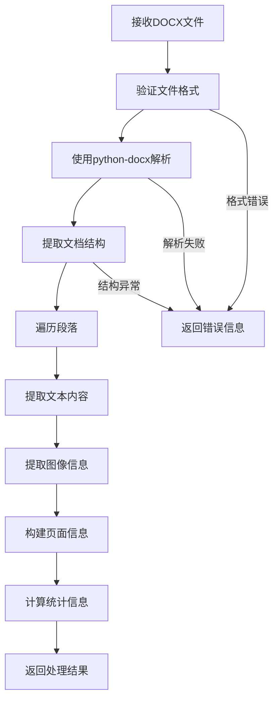
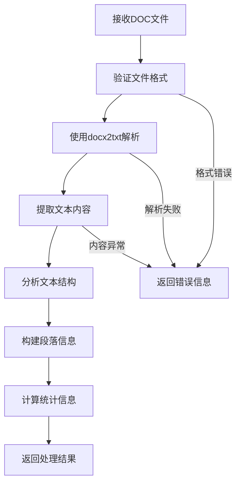

# DOC/DOCX 处理流程架构文档

## 概述

本文档详细描述了ConvertToText项目中DOC和DOCX文档处理功能的架构设计、处理流程和技术实现。

## 目录

1. [架构概览](#架构概览)
2. [技术栈](#技术栈)
3. [数据模型设计](#数据模型设计)
4. [核心服务架构](#核心服务架构)
5. [处理流程](#处理流程)
6. [API接口设计](#api接口设计)
7. [错误处理机制](#错误处理机制)
8. [性能优化策略](#性能优化策略)
9. [扩展性设计](#扩展性设计)

## 架构概览

### 整体架构图

```
┌─────────────────────────────────────────────────────────────┐
│                    DOC/DOCX 处理架构                        │
├─────────────────────────────────────────────────────────────┤
│  API Layer (FastAPI)                                       │
│  ┌─────────────────┐  ┌─────────────────┐  ┌──────────────┐ │
│  │              /extract              │ │
│  └─────────────────┘  └─────────────────┘  └──────────────┘ │
├─────────────────────────────────────────────────────────────┤
│  Service Layer                                              │
│  ┌─────────────────────────────────────────────────────────┐ │
│  │              DocExtractorService                        │ │
│  │  ┌─────────────┐  ┌─────────────┐  ┌─────────────────┐ │ │
│  │  │ DOCX处理    │  │ DOC处理     │  │ 图像提取        │ │ │
│  │  └─────────────┘  └─────────────┘  └─────────────────┘ │ │
│  └─────────────────────────────────────────────────────────┘ │
├─────────────────────────────────────────────────────────────┤
│  Data Layer                                                 │
│  ┌─────────────────────────────────────────────────────────┐ │
│  │  ┌─────────────┐  ┌─────────────┐  ┌─────────────────┐ │ │
│  │  │ 页面信息    │  │ 段落信息    │  │ 处理统计        │ │ │
│  │  └─────────────┘  └─────────────┘  └─────────────────┘ │ │
│  └─────────────────────────────────────────────────────────┘ │
├─────────────────────────────────────────────────────────────┤
│  External Libraries                                         │
│  ┌─────────────────┐  ┌─────────────────┐  ┌──────────────┐ │
│  │   python-docx   │  │    docx2txt     │  │   Pillow     │ │
│  └─────────────────┘  └─────────────────┘  └──────────────┘ │
└─────────────────────────────────────────────────────────────┘
```

### 核心组件

1. **API层**: 提供RESTful接口，处理HTTP请求
2. **服务层**: 核心业务逻辑，文档处理引擎
3. **数据层**: 数据模型和结构定义
4. **外部库层**: 第三方依赖库

## 技术栈

### 核心依赖

| 库名 | 版本 | 用途 |
|------|------|------|
| `python-docx` | 1.2.0 | DOCX文档解析和文本提取 |
| `docx2txt` | 0.9 | DOC格式文档处理 |
| `Pillow` | 10.0.0 | 图像处理和格式转换 |
| `fastapi` | 0.104.1 | Web API框架 |
| `pydantic` | 2.5.0 | 数据验证和序列化 |

### 支持格式

- **DOCX**: 现代Word文档格式，完整支持
- **DOC**: 传统Word文档格式，基础支持
- **图像格式**: PNG, JPEG, BMP, TIFF等

## 数据模型设计

### 枚举类型

```python
class DocType(str, Enum):
    """文档类型枚举"""
    DOC = "doc"
    DOCX = "docx"

class DocExtractionMethod(str, Enum):
    """提取方法枚举"""
    NATIVE_TEXT = "native_text"           # 原生文本提取
    OCR_PROCESSED = "ocr_processed"       # OCR处理后提取
    VISION_PROCESSED = "vision_processed" # 视觉模型处理
    OCR_VISION_FUSION = "ocr_vision_fusion" # OCR+视觉融合
    MIXED_CONTENT = "mixed_content"       # 混合内容处理
    IMAGE_ONLY = "image_only"             # 仅图像处理
    ERROR = "error"                       # 错误状态
```

### 核心数据模型

#### 1. 段落信息模型

```python
class ParagraphInfo(BaseModel):
    """段落信息"""
    paragraph_id: str                     # 段落唯一标识
    text: str                            # 段落文本内容
    page_number: int                     # 所在页码
    position: Optional[Position]         # 位置信息
    style: Optional[ParagraphStyle]      # 样式信息
    confidence: Optional[float]          # 置信度
    extraction_method: DocExtractionMethod # 提取方法
```

#### 2. 页面信息模型

```python
class PageInfo(BaseModel):
    """页面信息"""
    page_number: int                     # 页码
    width: float                         # 页面宽度
    height: float                        # 页面高度
    paragraphs: List[ParagraphInfo]      # 段落列表
    images: List[ImageInfo]              # 图像列表
    text_content: str                    # 页面文本内容
    word_count: int                      # 字数统计
```

#### 3. 处理统计模型

```python
class DocProcessingStats(BaseModel):
    """DOC处理统计信息"""
    total_pages: int                     # 总页数
    total_paragraphs: int                # 总段落数
    total_words: int                     # 总字数
    total_characters: int                # 总字符数
    processing_time: float               # 处理时间(秒)
    extraction_method: DocExtractionMethod # 主要提取方法
    success_rate: float                  # 成功率
    error_count: int                     # 错误数量
```

## 核心服务架构

### DocExtractorService 类结构

```python
class DocExtractorService:
    """DOC/DOCX文档提取服务"""
    
    def __init__(self):
        self.logger = get_logger(__name__)
    
    # 主要方法
    async def extract_text_from_docx(self, file_path: str) -> DocExtractionResult
    async def extract_text_from_doc(self, file_path: str) -> DocExtractionResult
    async def extract_images_from_docx(self, file_path: str) -> List[ImageInfo]
    async def get_document_info(self, file_path: str) -> DocDocumentInfo
    
    # 辅助方法
    def _extract_text_from_docx_native(self, file_path: str) -> str
    def _extract_text_from_doc_native(self, file_path: str) -> str
    def _extract_images_from_docx_native(self, file_path: str) -> List[ImageInfo]
    def _calculate_processing_stats(self, result: DocExtractionResult) -> DocProcessingStats
```

### 服务职责划分

1. **文档解析**: 使用python-docx和docx2txt解析文档结构
2. **文本提取**: 提取纯文本内容，保持段落结构
3. **图像处理**: 提取文档中的图像并转换为标准格式
4. **统计计算**: 计算处理统计信息
5. **错误处理**: 统一的错误处理和日志记录

## 处理流程

### DOCX处理流程



### DOC处理流程



### 详细处理步骤

#### 1. 文件验证阶段
- 检查文件是否存在
- 验证文件格式和扩展名
- 检查文件大小限制
- 验证文件完整性

#### 2. 文档解析阶段
- **DOCX**: 使用python-docx解析XML结构
- **DOC**: 使用docx2txt进行文本提取
- 提取文档元数据
- 分析文档结构

#### 3. 内容提取阶段
- 遍历文档段落
- 提取文本内容
- 保留格式信息
- 提取图像数据

#### 4. 数据处理阶段
- 构建页面信息
- 计算统计指标
- 生成处理报告
- 错误信息收集

#### 5. 结果返回阶段
- 序列化处理结果
- 返回统一格式数据
- 记录处理日志

## API接口设计

### 接口概览

| 端点 | 方法 | 功能 | 输入 | 输出 |
|------|------|------|------|------|
| `/api/v1/doc/extract` | POST | 统一DOC/DOCX文档提取 | 文件 | DocExtractionResult |
| `/api/v1/doc/health` | GET | 健康检查 | 无 | 状态信息 |

### 请求/响应格式

#### 统一提取接口

```http
POST /api/v1/doc/extract
Content-Type: multipart/form-data

{
  "file": <binary_file_data>
}
```

**响应格式**:
```json
{
  "success": true,
  "data": {
    "document_info": {
      "filename": "document.docx",
      "file_type": "docx",
      "file_size": 1024000,
      "page_count": 5
    },
    "pages": [
      {
        "page_number": 1,
        "text_content": "页面内容...",
        "word_count": 150,
        "paragraphs": [...]
      }
    ],
    "processing_stats": {
      "total_pages": 5,
      "total_words": 750,
      "processing_time": 2.5,
      "success_rate": 1.0
    }
  },
  "message": "文档处理成功"
}
```

### 错误响应格式

```json
{
  "success": false,
  "error": {
    "code": "INVALID_FILE_FORMAT",
    "message": "不支持的文件格式",
    "details": "仅支持DOC和DOCX格式"
  }
}
```

## 错误处理机制

### 错误分类

1. **文件错误**
   - 文件不存在
   - 文件格式不支持
   - 文件损坏
   - 文件大小超限

2. **解析错误**
   - 文档结构异常
   - 编码问题
   - 权限不足

3. **处理错误**
   - 内存不足
   - 超时错误
   - 依赖库错误

### 错误处理策略

```python
class DocProcessingError(Exception):
    """DOC处理异常基类"""
    pass

class InvalidFileFormatError(DocProcessingError):
    """无效文件格式异常"""
    pass

class DocumentParseError(DocProcessingError):
    """文档解析异常"""
    pass

class ProcessingTimeoutError(DocProcessingError):
    """处理超时异常"""
    pass
```

### 错误恢复机制

1. **重试机制**: 对于临时性错误，自动重试
2. **降级处理**: 部分功能失败时，返回部分结果
3. **错误日志**: 详细记录错误信息用于调试
4. **用户反馈**: 提供清晰的错误信息给用户

## 性能优化策略

### 1. 内存优化

- **流式处理**: 大文档分块处理
- **及时释放**: 处理完成后立即释放内存
- **缓存管理**: 合理使用缓存减少重复计算

### 2. 处理速度优化

- **并发处理**: 多页面并行处理
- **预加载**: 提前加载常用资源
- **算法优化**: 使用高效的文本处理算法

### 3. 资源管理

```python
class ResourceManager:
    """资源管理器"""
    
    def __init__(self):
        self.memory_limit = 512 * 1024 * 1024  # 512MB
        self.processing_timeout = 300  # 5分钟
    
    def check_memory_usage(self) -> bool:
        """检查内存使用情况"""
        pass
    
    def cleanup_resources(self):
        """清理资源"""
        pass
```

## 扩展性设计

### 1. 插件架构

```python
class DocProcessorPlugin:
    """文档处理器插件接口"""
    
    def can_handle(self, file_type: str) -> bool:
        """判断是否能处理指定格式"""
        pass
    
    def process(self, file_path: str) -> DocExtractionResult:
        """处理文档"""
        pass

class PluginManager:
    """插件管理器"""
    
    def register_plugin(self, plugin: DocProcessorPlugin):
        """注册插件"""
        pass
    
    def get_processor(self, file_type: str) -> DocProcessorPlugin:
        """获取处理器"""
        pass
```

### 2. 配置管理

```python
class DocProcessingConfig:
    """DOC处理配置"""
    
    # 文件限制
    max_file_size: int = 50 * 1024 * 1024  # 50MB
    supported_formats: List[str] = ["doc", "docx"]
    
    # 处理参数
    max_pages: int = 1000
    timeout_seconds: int = 300
    
    # 输出配置
    include_images: bool = True
    preserve_formatting: bool = True
```

### 3. 监控和日志

```python
class DocProcessingMonitor:
    """处理监控器"""
    
    def log_processing_start(self, file_info: dict):
        """记录处理开始"""
        pass
    
    def log_processing_end(self, stats: DocProcessingStats):
        """记录处理结束"""
        pass
    
    def log_error(self, error: Exception):
        """记录错误"""
        pass
```

## 部署和运维

### 1. 环境要求

- Python 3.8+
- 内存: 最小2GB，推荐4GB+
- 存储: 根据文档数量确定
- 网络: 支持文件上传下载

### 2. 配置建议

```yaml
# docker-compose.yml
version: '3.8'
services:
  convert-to-text:
    image: convert-to-text:latest
    ports:
      - "8000:8000"
    environment:
      - MAX_FILE_SIZE=52428800
      - PROCESSING_TIMEOUT=300
      - LOG_LEVEL=INFO
    volumes:
      - ./storage:/app/storage
    deploy:
      resources:
        limits:
          memory: 2G
        reservations:
          memory: 1G
```

### 3. 监控指标

- 处理成功率
- 平均处理时间
- 内存使用情况
- 错误率统计
- 并发处理数量

## 总结

本架构文档详细描述了DOC/DOCX处理功能的完整设计，包括：

1. **模块化设计**: 清晰的层次结构，便于维护和扩展
2. **标准化接口**: 统一的API设计，支持多种文档格式
3. **健壮性**: 完善的错误处理和恢复机制
4. **可扩展性**: 插件架构支持新格式和处理方法
5. **性能优化**: 多种优化策略确保高效处理

该架构为ConvertToText项目提供了稳定、高效的DOC/DOCX文档处理能力，能够满足各种业务需求。
