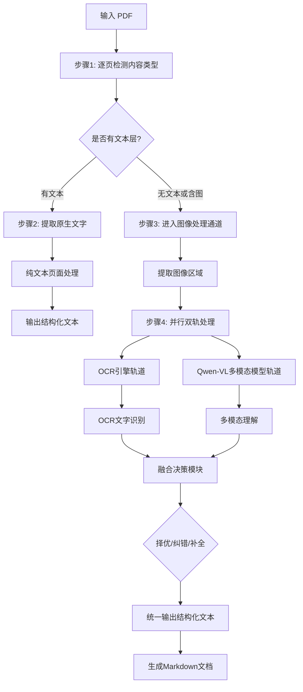

# PDF处理流程架构文档

## 概述

本文档详细描述了PDF文字提取系统的四步法处理流程，确保输入PDF后能够输出结构化的Markdown文档。

## 处理流程图



## 详细处理步骤

### 步骤1: 逐页检测内容类型

**目标**: 判断每页PDF的内容类型，决定后续处理策略

**实现方法**: `_analyze_page_content()`

**检测指标**:
- 原生文本长度 (`native_text_length`)
- 图像数量 (`images_count`)
- 文本块数量 (`text_blocks_count`)
- 图像块数量 (`image_blocks_count`)

**内容类型分类**:
1. `native_text_only` - 纯文本页面
2. `mixed_content` - 图文混合页面
3. `image_only` - 纯图像页面
4. `empty` - 空白页面

### 步骤2: 有文本 → 提取原生文字

**目标**: 从有文本层的页面直接提取文字内容

**实现方法**: `_extract_native_text_only()`

**处理流程**:
1. 使用PyMuPDF的`get_text()`方法提取原生文本
2. 使用`get_text("dict")`获取结构化文本块信息
3. 分析文本块结构，保留格式信息
4. 输出包含位置信息的结构化文本

**输出数据结构**:
```json
{
  "page_info": {
    "page_number": 1,
    "width": 595.0,
    "height": 842.0,
    "rotation": 0
  },
  "text": "提取的文本内容",
  "text_length": 1250,
  "text_blocks": [
    {
      "type": "text",
      "text": "文本块内容",
      "bbox": [x0, y0, x1, y1],
      "lines": [...]
    }
  ],
  "processing_type": "native_text",
  "extraction_method": "native_text_extraction"
}
```

### 步骤3: 无文本或含图 → 进入图像处理通道

**目标**: 处理扫描页面或包含图像的页面

**实现方法**: `_process_image_only_page()` 和 `_extract_mixed_content()`

**处理策略**:
- **纯图像页面**: 整页转换为图像进行处理
- **混合内容页面**: 提取原生文本 + 处理图像区域

**图像提取方法**:
1. 使用PyMuPDF的`get_images()`获取图像列表
2. 使用`extract_image()`提取图像数据
3. 转换为PIL图像格式进行后续处理

### 步骤4: 并行双轨处理

**目标**: 同时使用OCR和Qwen-VL进行文字识别，提高准确性和完整性

**实现方法**: 使用`concurrent.futures.ThreadPoolExecutor`实现真正的并行处理

#### OCR引擎轨道

**支持的引擎**:
- **PaddleOCR**: 对中文支持较好，速度快
- **Tesseract**: 对英文支持较好，准确率高

**处理流程**:
1. 图像预处理（去噪、增强对比度等）
2. 文字检测和识别
3. 置信度计算
4. 结果后处理

#### Qwen-VL多模态模型轨道

**支持的模型**:
- `qwen-vl-plus`: 标准版本
- `qwen-vl-max`: 增强版本

**处理流程**:
1. 图像预处理（调整大小、格式转换）
2. 编码为base64格式
3. 调用Qwen-VL API进行多模态理解
4. 解析返回结果

## 融合决策模块

**目标**: 智能融合OCR和Qwen-VL的结果，实现择优/纠错/补全

**实现方法**: `_fusion_decision_module()`

### 决策策略

#### 1. 基础决策逻辑
- **两者都成功**: 进入智能融合流程
- **仅OCR成功**: 使用OCR结果
- **仅Qwen-VL成功**: 使用Qwen-VL结果
- **两者都失败**: 返回错误信息

#### 2. 智能融合策略

**评分指标**:
- **置信度权重** (40%): OCR和Qwen-VL的置信度
- **长度权重** (30%): 文本长度指标
- **质量权重** (30%): 文本质量得分

**文本质量计算**:
- 长度得分: `min(len(text) / 200, 1.0)`
- 多样性得分: `min(unique_chars / 50, 1.0)`
- 中文比例得分: `min(chinese_ratio * 2, 1.0)`
- 结构化得分: `min(digit_punct_count / 20, 1.0)`

**融合策略**:
- **得分相近** (差异 < 0.1): 合并结果，去重处理
- **OCR得分更高**: 以OCR为主，Qwen-VL补充
- **Qwen-VL得分更高**: 以Qwen-VL为主，OCR补充

### 融合方法

#### 1. 智能合并 (`_merge_texts()`)
- 按行分割文本
- 去重处理，保持顺序
- 合并为完整文本

#### 2. OCR增强 (`_enhance_with_vision()`)
- 以OCR结果为主
- 用Qwen-VL结果补充缺失信息

#### 3. Qwen-VL增强 (`_enhance_with_ocr()`)
- 以Qwen-VL结果为主
- 用OCR结果补充细节信息

## 输出数据结构

### 页面级输出

```json
{
  "page_info": {
    "page_number": 1,
    "width": 595.0,
    "height": 842.0,
    "rotation": 0
  },
  "text": "最终提取的文本内容",
  "text_length": 1250,
  "text_blocks": [...],
  "images_count": 2,
  "images_info": [...],
  "processing_type": "ocr_vision_fusion",
  "extraction_method": "intelligent_merge",
  "content_analysis": {...},
  "is_text_page": true,
  "has_images": true
}
```

### 文档级输出

```json
{
  "file_path": "/path/to/document.pdf",
  "total_pages": 5,
  "pages": [...],
  "full_text": "所有页面的合并文本",
  "has_text_layer": true,
  "is_scanned": false,
  "extraction_method": "four_step_process",
  "processing_stats": {
    "native_text_pages": 3,
    "ocr_processed_pages": 1,
    "image_only_pages": 1,
    "mixed_content_pages": 0
  }
}
```

## 性能优化

### 并行处理优化
- 使用线程池同时执行OCR和Qwen-VL处理
- 设置合理的超时时间（OCR: 30秒，Qwen-VL: 60秒）
- 异常处理确保单个任务失败不影响整体流程

### 内存优化
- 及时释放图像数据
- 使用流式处理大文件
- 合理设置图像分辨率

### 缓存策略
- 对相同页面内容进行缓存
- 避免重复处理相同图像

## 错误处理

### 异常分类
1. **文件读取异常**: PDF文件损坏或权限问题
2. **OCR处理异常**: 引擎初始化失败或识别超时
3. **Qwen-VL异常**: API调用失败或网络问题
4. **融合异常**: 结果处理失败

### 降级策略
1. **OCR失败**: 仅使用Qwen-VL结果
2. **Qwen-VL失败**: 仅使用OCR结果
3. **两者都失败**: 返回错误信息，记录日志
4. **融合失败**: 降级到简单合并策略

## 配置参数

### 关键参数
- `min_text_length`: 最小文本长度阈值 (默认: 10)
- `ocr_timeout`: OCR处理超时时间 (默认: 30秒)
- `vision_timeout`: Qwen-VL处理超时时间 (默认: 60秒)
- `max_workers`: 并行处理线程数 (默认: 2)

### 质量阈值
- `confidence_weight`: 置信度权重 (默认: 0.4)
- `length_weight`: 长度权重 (默认: 0.3)
- `quality_weight`: 质量权重 (默认: 0.3)
- `score_threshold`: 得分差异阈值 (默认: 0.1)

## 使用示例

### 基本使用
```python
from app.services.pdf_extractor import pdf_extractor

# 提取PDF文字
result = pdf_extractor.extract_text_from_pdf(
    pdf_path="document.pdf",
    use_ocr=True,
    ocr_engine=OCREngine.PADDLEOCR,
    use_vision=True,
    vision_model="qwen-vl-plus"
)

# 获取结构化文本
structured_text = result["full_text"]
```

### 高级配置
```python
# 自定义处理参数
result = pdf_extractor.extract_text_from_pdf(
    pdf_path="complex_document.pdf",
    use_ocr=True,
    ocr_engine=OCREngine.TESSERACT,
    use_vision=True,
    vision_model="qwen-vl-max"
)

# 分析处理统计
stats = result["processing_stats"]
print(f"原生文本页面: {stats['native_text_pages']}")
print(f"OCR处理页面: {stats['ocr_processed_pages']}")
print(f"图像页面: {stats['image_only_pages']}")
```

## 总结

本PDF处理流程架构实现了：

1. **智能内容检测**: 自动识别页面类型，选择最优处理策略
2. **并行双轨处理**: OCR和Qwen-VL同时工作，提高处理效率
3. **智能融合决策**: 基于多维度评分进行结果融合
4. **结构化输出**: 生成包含完整元数据的结构化文档
5. **错误容错**: 完善的异常处理和降级策略

该架构确保了从输入PDF到输出结构化Markdown文档的完整流程，提供了高质量、高可靠性的文字提取服务。
